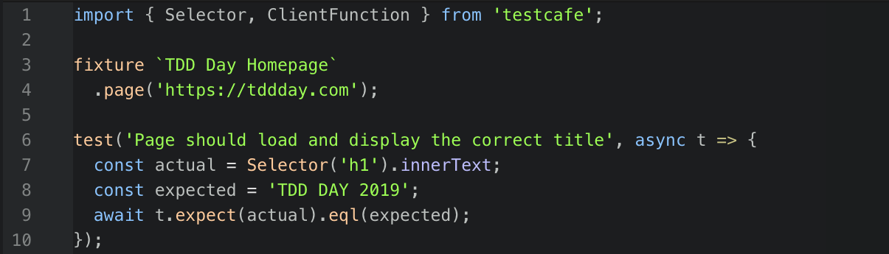

> Eric Elliot의 [Behavior Driven Development(BDD) and Functional Testing](https://medium.com/javascript-scene/behavior-driven-development-bdd-and-functional-testing-62084ad7f1f2/) 번역글입니다. 굳이 이 글이 아니더라도 모든 번역글은 역자의 의도와 상관없이 원문의 내용과 다르게 전달될 수 있으니 원문도 같이 보시는 걸 권해드립니다.

단위 테스트(Unit test)는 코드 단위가 애플리케이션의 나머지 부분과 격리되어 테스트되는 방법이다. 이를 통해 특정 함수, 객체, 클래스, 모듈 등을 테스트할 수 있으며, 애플리케이션의 개별 부분이 잘 작동하는지를 알아보는 데 유용하다.

하지만 단위 테스트는 이러한 코드 단위가 모여 전체 애플리케이션이 구성되었을 때에도 잘 작동하는지를 테스트하지는 않는다. 이를 위해서는 복수 개의 협동 테스트(Collaboration test)나 E2E 테스트(End-to-end test, aka System test) 등과 같은 통합 테스트(Integration test)가 필요하다.

시스템 테스트에는 행위 주도 개발(이하 BDD), 기능 테스트(Funtional test)를 포함한 여러 가지 방법론들이 있다.



***

# 행위 주도 개발이란 무엇인가?

BDD는 테스트 주도 개발(Test Driven Development)의 한 분야이다. BDD는 사람이 읽을 수 있는 사용자 요구사항 명세를 소프트웨어 테스트의 기반으로 사용한다. 도메인 주도 설계(Domain Driven Design)와 마찬가지로, BDD의 초기 단계는 이해관계자, 도메인 전문가, 엔지니어 간의 공유된 어휘를 정의하는 것이다. 이 단계에서는 엔티티, 이벤트, 출력 등을 정의하고, 정의한 요소들에 모두가 동의할 수 있는 이름을 지정하는 작업들이 포함된다.

그 후 실무자들은 사용자 승인 테스트(User Acceptance Test)와 같은 시스템 테스트를 작성하는데 사용할 수 있는 도메인 별 언어(Domain Specific Language)를 만들기 위해 이 어휘들을 사용한다.

각 테스트는 영어와 공식적으로 지정된 유비쿼터스 언어(모든 이해관계자가 공유하는 어휘)로 작성된 사용자 스토리를 기반으로 한다.

예를 들어 암호화폐 지갑의 이체 테스트는 아래와 같다.

```
스토리: 이체 후 잔액 변경

지갑 사용자로서
돈을 보내기 위해
지갑 잔액을 업데이트 해야한다.

내 잔액이 $40 이고,
친구 잔액이 $10 임을 감안할 때,
친구에게 $20을 송금하면
내 잔고는 $20이 되어야 한다.
그리고 친구는 $30이 되어야 한다.
```

이 언어는 소프트웨어의 UI나 목표를 달성하는 방법 보다는 고객이 소프트웨어로부터 얻어야 하는 비즈니스 가치에만 초점을 맞춘다는 것에 유의해야 한다. 대신 UX 디자인 프로세스의 시작점으로 사용할 수 있고, 이러한 종류의 사용자 요구사항을 미리 설계하면 실무자들과 고객이 어떤 제품을 만들고 있는지에 대해 동일한 입장을 취할 수 있도록 도울 수 있어 프로세스 후반에 생길 수 있는 많은 재작업들을 줄일 수 있다.

이 단계에서 아래 두 단계로 진행할 수 있다.

1. 설명을 도메인 별 언어로 변환하여 human-readable한 설명에 machine-readable한 코드가 추가되도록 테스트에 구체적인 기술적 의미를 부여한다. (즉 BDD를 계속 진행)
2. 사용자 스토리를 JavaScript, Rust 등과 같은 범용 언어를 활용하여 자동화된 테스트로 변환한다. (기능 테스트로 전환)

보통 어느 쪽이든 블랙박스 테스트로 처리하여 테스트 코드가 테스트 중인 기능의 구현 세부사항에 신경을 안 쓰게끔 하는 것이 좋다. 블랙박스 테스트는 화이트박스 테스트와 달리 구현 세부사항과 결합되지 않으므로 요구사항이 추가/변경되거나 코드가 리팩토링될 때 상대적으로 덜 취약하다.

BDD 지지자들은 [Cucumber](https://github.com/cucumber/cucumber-js/)와 같은 도구를 사용하여 맞춤형 DSL을 만들고 관리한다.

이와 반대로, 기능 테스트 지지자들은 일반적으로 사용자 인터랙션을 시뮬레이션하고 실제 출력과 예상 출력을 비교하여 기능을 테스트한다. 웹 애플리케이션의 경우, 이는 보통 타이핑, 버튼 클릭, 스크롤, 확대/축소, 드래그 등을 시뮬레이션하기 위해 웹 브라우저와 상호작용하는 테스트 프레임워크를 사용하는 것을 의미한다.

필자(*역주: Eric Elliot*)는 일반적으로 BDD를 유지하기보단 사용자 요구사항을 기능 테스트로 변환하는 것을 선호한다. 애플리케이션과 BDD 프레임워크를 통합하는데 요구되는 복잡성과 여러 시스템 및 구현 언어들에 걸쳐있는 DSL 유지보수 비용이 높기 때문이다.

또한 human-readable한 DSL은 이해관계자들과의 커뮤니케이션 용도로써 고수준의 명세서에는 적합하지만, 일반적인 소프트웨어 시스템은 제품 장애를 일으키는 버그를 방지하기 위한 적절한 코드와 테스트 커버리지 생성을 위해 더 낮은 수준에서의 테스트가 필요할 것이다.

예를 들어 "친구에게 $20을 송금한다." 요구사항은 다음과 같이 변환되어야 한다.

1. 지갑 오픈
2. 송금 클릭
3. 금액 입력
4. 송금 지갑 주소 입력
5. 송금하기 클릭
6. 확인 모달 대기
7. 거래확인 클릭

화면 아래의 계층에서는 송금 관련 워크플로우의 상태를 관리하며 정확한 금액이 지갑 주소로 전송되는지 단위 테스트를 필요로 할 것이다. 이보다 더 아래의 계층에서는 실제로 지갑 잔액이 적절하게 변경되었는지 확인하기 위해 블록체인 API를 활용할 것이고, 이러한 과정들은 클라이언트가 확인하기 힘들다.

이러한 서로 다른 테스트 요구사항은 각기 다른 테스트 단계에서 가장 잘 처리할 수 있다.

1. 단위 테스트는 로컬 클라이언트 상태가 올바르게 업데이트 되고, 이에 따라 화면에 올바르게 표시되는지 테스트할 수 있다.
2. 기능 테스트는 UI 인터랙션과 UI 상에서 사용자 요구사항이 충족되었는지 테스트할 수 있다. 이를 통해 UI 요소들이 적절히 연결되었는지도 확인할 수 있다.
3. 통합 테스트는 API 통신이 제대로 이루어지고 있는지, 사용자 지갑 금액이 실제로 블록체인 상에 올바르게 반영되었는지 테스트할 수 있다.

필자는 하위 계층 동작은 말할 것도 없고, 최상위 계층인 UI 동작을 검증하는 모든 기능 테스트를 조금이라도 이해하고 있는 이해관계자들을 본 적이 없다. 정작 이들은 관심이 없는데 DSL을 만들고 유지보수하는데 비용을 들일 필요가 있을까? 전체 BDD 프로세스를 수행하든 안 하든, 우리가 놓치지 말아야 할 훌륭한 아이디어와 관행들이 많다.

- 엔지니어와 이해관계자들이 사용자 요구사항과 소프트웨어 솔루션에 대해 효과적으로 의사소통을 하기 위한 공유 어휘를 정의해야 한다.
- 소프트웨어의 특정 기능에 대한 허용 기준 및 수행 완료의 정의를 위한 사용자 스토리 및 시나리오를 작성해야 한다.
- 사용자, 제품팀, 품질팀, 엔지니어 간의 협업을 통해 팀이 구축하고 있는 내용에 대한 합의를 도출해야 한다.

그렇다면 또 다른 시스템 테스트 중 하나인 기능 테스트는 무엇일까?

***

# 기능 테스트란 무엇인가?

기능 테스트란 용어 자체는 여러 의미를 갖고 있기 때문에 혼란스러울 수 있다. [IEEE 24765](https://www.iso.org/standard/71952.html)는 아래 두 의미로 정의하고 있다.

1. 시스템 또는 구성 요소의 내부 메커니즘을 무시하고 선택한 입력 및 실행 조건에 대한 응답으로 생성된 출력에만 초점을 맞춘 테스트 (예: 블랙박스 테스트)
2. 특정 기능 요구사항을 가진 시스템 또는 구성 요소의 적합성을 평가하기 위해 수행되는 테스트

첫 번째 정의는 거의 모든 테스트 방식에 적용될 만큼 일반적이며, 이미 소프트웨어 테스터들이 완벽하게 이해하고 있는 블랙박스 테스트가 있다. 두 번째 정의는 일반적으로 앱의 기능과는 직접적인 관련이 없는 로딩 시간, UI 응답 시간, 서버 로드 테스트, 보안 침투 테스트 등 앱의 다른 특성에 중점을 둔다. 이 정의는 꽤나 모호해서 그 자체만으로는 유용하지 않다. 때문에 우리는 보통 단위 테스트, 스모크 테스트, 사용자 승인 테스트 등 어떤 종류의 테스트를 우리가 수행해야 하는지 더 구체적으로 알고 싶어한다.

이러한 이유로 필자는 IBM의 Developer Works에서 정의한 다음을 선호한다.

***기능 테스트는 사용자 관점에서 작성되며, 사용자가 관심을 갖는 시스템 동작에 초점을 맞춘다.***

이는 훨씬 더 명확하지만 우리가 테스트를 자동화하고 해당 테스트를 사용자 관점에서 수행할 거라면, 그것은 UI와 상호작용하는 테스트를 작성해야 함을 의미한다. 이러한 테스트는 "UI 테스트" 또는 "E2E 테스트"라는 이름으로도 불릴 수 있지만, "친구에게 돈을 송금할 수 있어야 한다."와 같은 사용자 요구사항과 직접적인 관련이 없는 스타일이나 색상 등을 테스트하는 UI 테스트 클래스가 있기 때문에 기능 테스트라는 용어의 필요성을 대체하지는 않는다.

