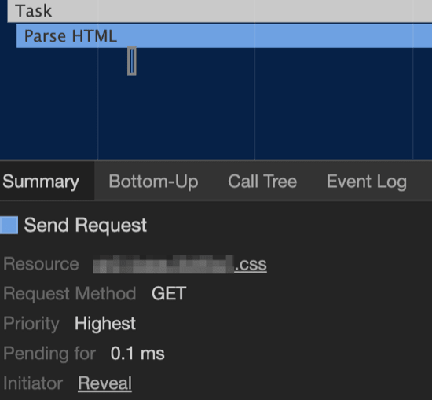
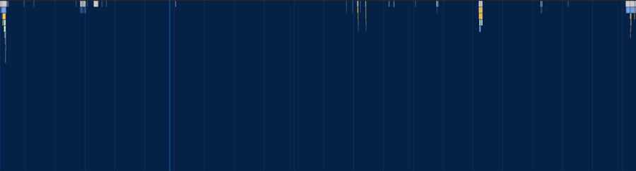
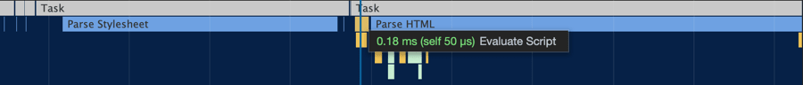
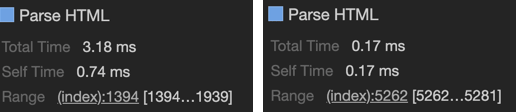

> Tim Kadlec의 [When CSS Blocks](https://timkadlec.com/remembers/2020-02-13-when-css-blocks/) 번역글입니다. 굳이 이 글이 아니더라도 모든 번역글은 역자의 의도와 상관없이 원문의 내용과 다르게 전달될 수 있으니 원문도 같이 보시는 걸 권해드립니다.

이 글에서는 ***preload***를 왜 주의해서 사용해야 하는지, 또 Document 순서가 성능에 어떻게 중요한 영향을 미칠 수 있는지 필자가 경험한 실제 사례에 기반하여 설명하고자 한다(참고: [Harry Roberts가 상세하게 설명한 글](https://csswizardry.com/2018/11/css-and-network-performance/)이 있다).

필자는 [Filament Group](https://www.filamentgroup.com/)의 열렬한 팬이다. 그들은 엄청난 양의 고품질 작업물들을 생산하여 지속적으로 웹 개선을 위한 리소스들을 제공하고 있다. [loadCSS](https://github.com/filamentgroup/loadCSS)는 그 작업물 중 하나인데, 이 프로젝트는 필자가 오랫동안 중요하지 않은 CSS를 로드하는 방법으로 권장해온 것이다.

[Filament Group](https://www.filamentgroup.com/)의 작업 방향이 [바뀌긴 했지만](https://www.filamentgroup.com/lab/load-css-simpler/), 필자는 여전히 운영 환경에서 사용하고 있다.

필자가 주목한 패턴 중 하나는 ***preload/polyfill*** 패턴이다. 이 패턴에서는 스타일시트를 preload로 사전에 로드한 다음, onload 이벤트를 사용하여 브라우저가 준비되었을 때 스타일시트로 다시 돌아가 작업을 진행할 수 있다. 아래는 preload의 예시이다.

```html
<link
  rel="preload"
  href="path/to/mystylesheet.css"
  as="style"
  onload="this.rel='stylesheet'"
>
<noscript>
  <link rel="stylesheet" href="path/to/mystylesheet.css">
</noscript>
```

모든 브라우저가 preload 기능을 지원하는 것은 아니기 때문에, loadCSS는 다음과 같이 polyfill을 제공한다.

```html
<link
  rel="preload"
  href="path/to/mystylesheet.css"
  as="style"
  onload="this.rel='stylesheet'"
>
<noscript>
  <link rel="stylesheet" href="path/to/mystylesheet.css">
</noscript>
<script>
/*! loadCSS rel=preload polyfill. [c]2017 Filament Group, Inc. MIT License */
(function(){ ... }());
</script>
```

***

## 네트워크 우선 순위 조정

preload를 사용하면 어떤 자원이든 바로 다운로드가 가능하다. 스타일시트 같은 초기 렌더링에 그다지 중요하지 않은 자원들에 대해 preload를 사용하면 브라우저가 비동기 처리 대상으로 판단하여 매우 높은 우선순위를 가지고, 다른 자원과 상관없이 바로 다운로드가 시작된다.

아래 이미지가 좋은 예시이다. 3 ~ 6번이 preload를 사용하여 비동기적으로 로드되는 CSS 파일이다. 설령 해당 CSS가 초기 렌더링을 차단할 정도로 중요하지 않다 하더라도 preload를 사용하면 사용하지 않은 자원들보다 먼저 도착한다.


***

## HTML 파서 차단

네트워크 우선 순위 문제는 대부분의 상황에서 preload를 피하는 이유이다. 하지만 아래 코드처럼 외부에서 로드하는 다른 CSS가 더 있을 경우 문제가 복잡해진다.

```html
<link rel="stylesheet" href="path/to/main.css">
<link
  rel="preload"
  href="path/to/mystylesheet.css"
  as="style"
  onload="this.rel='stylesheet'"
>
<noscript>
  <link rel="stylesheet" href="path/to/mystylesheet.css">
</noscript>
<script>
/*! loadCSS rel=preload polyfill. [c]2017 Filament Group, Inc. MIT License */
(function(){ ... }());
</script>
```

위에서 설명한대로 preload를 사용한 스타일시트는 그것이 중요하든 중요하지 않든 높은 우선 순위를 가지고 바로 다운로드를 시작하며, 이러한 동작이 브라우저의 페이지 해석에 영향을 미칠 수 있다. 다시 말하지만 [Harry Roberts가 이것에 대해 상세하게 설명한 글](https://csswizardry.com/2018/11/css-and-network-performance/)이 있기 때문에 꼭 읽어보기를 추천한다.

여기서 간략히 설명하자면, 일반적으로 스타일시트는 페이지의 렌더링을 차단한다. 브라우저는 페이지를 표시하기 위해 스타일시트를 요청하고 해석해야 한다. 다만 이러한 과정중에 브라우저가 HTML의 나머지 부분을 해석하는 과정을 멈추지는 않는다.

반면에 스크립트(`<script>`)는 defer나 async 속성이 없는 한 파서를 차단한다. 브라우저는 스크립트가 페이지 자체 또는 페이지에 적용되는 스타일을 조작할 수 있다고 가정해야 하므로 HTML 해석을 멈추고 스크립트 실행을 우선한다. 만약 요청중인 스타일시트가 있을 경우, 앞선 정의에 의해 스크립트가 실행되기 전에 해당 스타일시트가 도착할 때까지 기다린다. 즉, 스타일시트가 더이상 렌더링만 막는 것이 아니라 HTML 해석을 막는 것이다. 이 블로킹 동작은 외부 스크립트뿐만 아니라 인라인 스크립트에도 동일하게 적용된다.

***

## 문제 파악하기

이를 시각화할 수 있는 가장 명확한 방법은 Chrome의 개발자 도구를 살펴보는 것이다.

Chrome 개발자 도구에서 성능 패널을 사용하여 페이지 로드의 프로필을 캡처할 수 있다. (스로틀링된 네트워크 설정을 사용하면 문제를 더욱 명확하게 파악할 수 있다.)

아래 테스트에서는 Fast 3G 설정을 사용하여 테스트를 실행했다. 메인 스레드 액티비티를 확대하면 HTML 파싱의 첫 번째 청크(페이지 로드 프로세스 중 약 1.7초) 동안 CSS 파일에 대한 요청이 발생하는 것을 확인할 수 있다.



그 후 1초 정도 동안 메인 스레드가 잠잠해진다. 약간의 액티비티가(preload된 스타일시트에서 로드 이벤트가 발생하고, 브라우저의 preloader에서 더 많은 요청이 전송되는 등)가 있지만 브라우저는 HTML 해석을 완전히 중단했다.



약 2.8초 후에 스타일시트가 도착하고 브라우저는 이를 해석한다. 그 후에야 인라인 스크립트가 평가되고 브라우저가 마침내 HTML 해석을 시작한다.



## Firefox 예외

이 블로킹 동작은 Chrome, Edge, Safari에 적용된다. 단, Firefox는 예외다.

다른 모든 브라우저는 HTML 해석을 일시 중지하지만 lookahead parser(preloader)를 사용하여 외부 리소스를 검색하고 요청한다. 하지만 Firefox는 한 단계 더 나아가 스크립트 실행을 기다리는 동안에도 [DOM 트리를 추론하여 구축](https://developer.mozilla.org/en-US/docs/Glossary/speculative_parsing)한다.

스크립트가 DOM을 조작하여 추론적 해석 작업을 초래하지 않는 한 Firefox가 먼저 해석을 시작할 수 있다. 물론, 스크립트가 DOM을 조작한다면 이 추론 작업은 아무 소용이 없다.

흥미로운 접근 방식이며 얼마나 효과적인지 매우 궁금하지만, 현재로서는 Firefox의 성능 프로파일러에서 이를 확인할 수 없다. 프로파일러에서 이 구문 분석 작업을 다시 수행해야 하는지, 수행해야 한다면 성능 비용은 얼마인지 확인할 수 없다.

하지만 Firefox 개발자 도구를 개발하는 훌륭한 개발자들과 이야기를 나눈 결과, 그들은 향후 해당 정보를 어떻게 표시할 수 있을지에 대한 흥미로운 아이디어를 가지고 있었다.

## 문제 해결

다시 돌아와서 앞선 preload가 야기하는 문제의 경우 이를 해결하기 위한 첫 번째 단계는 매우 간단하다. preload/polyfill 패턴을 버리는 것이다. 중요하지 않은 CSS를 미리 로드하는 것은 목적에 어긋나며, 현재 Filament Group에서 권장하는 대로 preload 대신 print 속성을 주어 스타일시트를 사용하도록 전환하면 polyfill을 완전히 제거할 수 있다.

```html
<link
  rel="preload"
  href="path/to/mystylesheet.css"
  media="print"
  onload="this.media='all'"
>
```

이제 네트워크 우선순위가 다운로드되는 자원의 실제 중요도와 훨씬 더 잘 일치하고 인라인 스크립트 블록이 제거되어 더 나은 상태로 개선되었다.

필자가 겪은 문제의 경우 CSS가 요청된 후에도 HTML 문서 앞 쪽에 인라인 스크립트가 하나 더 있었다. 해당 스크립트를 DOM의 스타일시트 앞으로 옮기니 파서 차단 동작이 사라졌다. Chrome 개발자 도구의 성능 패널을 다시 살펴보면 그 차이가 명확하게 드러난다.



이전에는 CSS가 로드되기를 기다리다가 1939번째 줄에서 멈췄지만, 이제는 페이지 끝에서 또 다른 인라인 스크립트가 발생하는 5281번째 줄까지 해석한 후 파서가 다시 블로킹된다.

이 방법은 빠른 해결책이지만 최종 해결책이 될 수 있는 방법도 아니다. 순서를 바꾸고 preload/polyfill 패턴을 버리는 것은 첫 번째 단계에 불과하다. 여기서 가장 큰 이점은 중요한 CSS를 외부 파일에서 참조하는 대신 인라인화 함으로써 얻을 수 있다(preload/polyfill 패턴은 인라인 CSS와 함께 사용하기 위한 것이다). 이렇게 하면 스크립트 관련 문제를 완전히 무시할 수 있고 브라우저가 첫 번째 네트워크 요청에서 페이지를 렌더링하는 데 필요한 모든 CSS를 확보할 수 있다.

하지만 당장은 CSS를 로드하는 방식과 DOM 순서를 조금만 변경하면 성능을 크게 향상시킬 수 있다.

요약하자면

- preload/polyfill 패턴과 함께 loadCSS를 사용하는 경우 대신 print 스타일시트 패턴을 사용하는 것이 좋다.
- 정상적으로 로드하는 외부 스타일시트가 있는 경우(즉, 일반적인 스타일시트 링크로 로드하는 경우) 마크업에서 가능한 모든 인라인 스크립트를 그 위로 이동하는 것이 좋다.
- 최대한 빠른 렌더링 시작을 위해 중요한 CSS를 인라인화 하는 것이 좋다.
