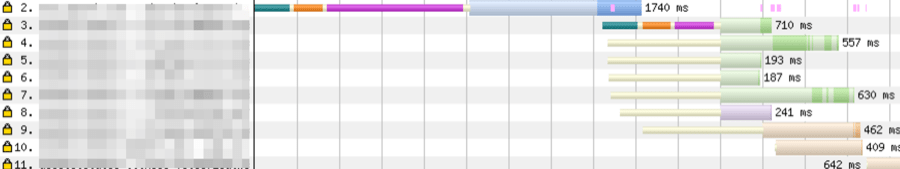

> Tim Kadlec의 [When CSS Blocks](https://timkadlec.com/remembers/2020-02-13-when-css-blocks/) 번역글입니다. 굳이 이 글이 아니더라도 모든 번역글은 역자의 의도와 상관없이 원문의 내용과 다르게 전달될 수 있으니 원문도 같이 보시는 걸 권해드립니다.

이 글에서는 ***preload***를 왜 주의해서 사용해야 하는지, 또 Document 순서가 성능에 어떻게 중요한 영향을 미칠 수 있는지 실제 사례에 기반하여 설명하고자 한다(참고: [Harry Roberts가 상세하게 설명한 글](https://csswizardry.com/2018/11/css-and-network-performance/)이 있다).

필자는 [Filament Group](https://www.filamentgroup.com/)의 열렬한 팬이다. 그들은 엄청난 양의 고품질 작업물들을 생산하여 지속적으로 웹 개선을 위한 리소스들을 제공하고 있다. [loadCSS](https://github.com/filamentgroup/loadCSS)는 그 작업물 중 하나인데, 이 프로젝트는 필자가 오랫동안 중요하지 않은 CSS를 로드하는 방법으로 권장해온 것이다.

[Filament Group](https://www.filamentgroup.com/)의 작업 방향이 [바뀌긴 했지만](https://www.filamentgroup.com/lab/load-css-simpler/), 필자는 여전히 운영 환경에서 사용하고 있다.

필자가 주목한 패턴 중 하나는 ***preload/polyfill*** 패턴이다. 이 패턴에서는 스타일시트를 preload로 사전에 로드한 다음, onload 이벤트를 사용하여 브라우저가 준비되었을 때 스타일시트로 다시 돌아가 작업을 진행할 수 있다. 아래는 preload의 예시이다.

```html
<link rel="preload" href="path/to/mystylesheet.css" as="style" onload="this.rel='stylesheet'">
<noscript><link rel="stylesheet" href="path/to/mystylesheet.css"></noscript>
```

모든 브라우저가 preload 기능을 지원하는 것은 아니기 때문에, loadCSS는 다음과 같이 polyfill을 제공한다.

```html
<link rel="preload" href="path/to/mystylesheet.css" as="style" onload="this.rel='stylesheet'">
<noscript>
  <link rel="stylesheet" href="path/to/mystylesheet.css">
</noscript>
<script>
/*! loadCSS rel=preload polyfill. [c]2017 Filament Group, Inc. MIT License */
(function(){ ... }());
</script>
```

***

## 네트워크 우선 순위 조정

preload를 사용하면 어떤 자원이든 바로 다운로드가 가능하다. 스타일시트 같은 초기 렌더링에 그다지 중요하지 않은 자원들에 대해 preload를 사용하면 브라우저가 비동기 처리 대상으로 판단하여 매우 높은 우선순위를 가지고, 다른 자원과 상관없이 바로 다운로드가 시작된다.

아래 이미지가 좋은 예시이다. 3 ~ 6번이 preload를 사용하여 비동기적으로 로드되는 CSS 파일이다. 설령 해당 CSS가 초기 렌더링을 차단할 정도로 중요하지 않다 하더라도 preload를 사용하면 사용하지 않은 자원들보다 먼저 도착한다.



***

## HTML 파서 차단

네트워크 우선 순위 문제는 대부분의 상황에서 preload를 피하는 이유이다. 하지만 아래 코드처럼 외부에서 로드하는 다른 CSS가 더 있을 경우 문제가 복잡해진다.

```html
<link rel="stylesheet" href="path/to/main.css">
<link rel="preload" href="path/to/mystylesheet.css" as="style" onload="this.rel='stylesheet'">
<noscript>
  <link rel="stylesheet" href="path/to/mystylesheet.css">
</noscript>
<script>
/*! loadCSS rel=preload polyfill. [c]2017 Filament Group, Inc. MIT License */
(function(){ ... }());
</script>
```

위에서 설명한대로 preload를 사용한 스타일시트는 그것이 중요하든 중요하지 않든 높은 우선 순위를 가지고 바로 다운로드를 시작하며, 이러한 동작이 브라우저의 페이지 해석에 영향을 미칠 수 있다. 다시 말하지만 [Harry Roberts가 이것에 대해 상세하게 설명한 글](https://csswizardry.com/2018/11/css-and-network-performance/)이 있기 때문에 꼭 읽어보기를 추천한다.

여기서 간략히 설명하자면, 일반적으로 스타일시트는 페이지의 렌더링을 차단한다. 브라우저는 페이지를 표시하기 위해 스타일시트를 요청하고 해석해야 한다. 다만 이러한 과정중에 브라우저가 HTML의 나머지 부분을 해석하는 과정을 멈추지는 않는다.

반면에 스크립트(`<script>`)는 defer나 async 속성이 없는 한 파서를 차단한다. 브라우저는 스크립트가 페이지 자체 또는 페이지에 적용되는 스타일을 조작할 수 있다고 가정해야 하므로 HTML 해석을 멈추고 스크립트 실행을 우선한다. 만약 요청중인 스타일시트가 있을 경우, 앞선 정의에 의해 스크립트가 실행되기 전에 해당 스타일시트가 도착할 때까지 기다린다. 즉, 스타일시트가 더이상 렌더링만 막는 것이 아니라 HTML 해석을 막는 것이다. 이 블로킹 동작은 외부 스크립트뿐만 아니라 인라인 스크립트에도 동일하게 적용된다.

***

## 문제 들여다보기


